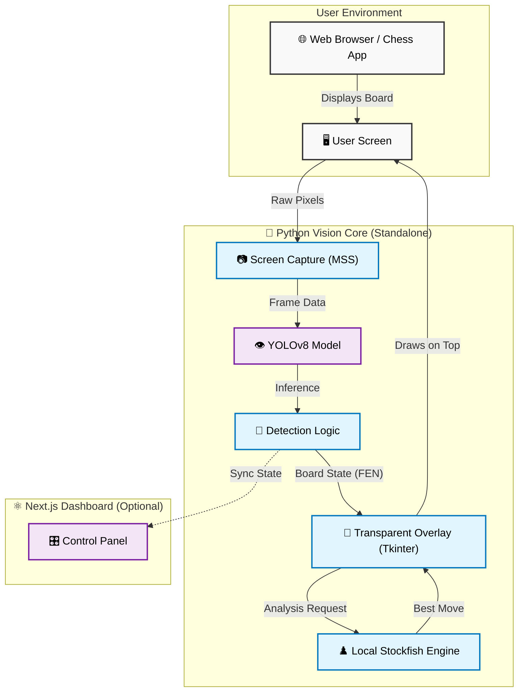

<div align="center">

# MoveOverlay: Chess Vision AI
### Simple, effective, and completely injection-free.
[](https://github.com/editzinter/moveOverlay/blob/main/LICENSE)
[](https://nextjs.org/)
[](https://www.python.org/)
[](https://ultralytics.com/)

---

**MoveOverlay** is a visual-first tool designed for players who want engine analysis without the risks of browser extensions or code injection. It works by "looking" at your screen just like you do, analyzing the board in real-time and drawing tactical advice directly on a transparent overlay.

[Features](#what-makes-it-different) • [How it Works](#how-it-works) • [Installation](#getting-started) • [Usage](#usage)

</div>

---

> [!CAUTION]
> **Educational Use Only**: I built this project to explore how computer vision (YOLOv8) can interact with real-time screen data. It’s meant for learning and research. Please be responsible and keep in mind the terms of service of the platforms you use.

---

## What makes it different?

Most chess tools try to dig into a website's internal code. **MoveOverlay doesn't.** 

- **Privacy & Safety First**: It analyzes pixels, not browser memory. This means it doesn't touch your browser's internal logic or personal data.
- **Smart Vision**: Uses a fine-tuned YOLOv8 model to "see" pieces and board boundaries exactly as they appear on your screen.
- **Live Guidance**: Once it detects the board, it talks to Stockfish to suggest the best moves and displays them as arrows on a transparent layer.
- **Clean Dashboard**: A simple Next.js interface lets you control everything—adjust engine depth, switch sides, or toggle the overlay on the fly.
- **Zero Configuration**: It automatically figures out if you're playing as White or Black by checking where your pawns are.

---

## How it works

MoveOverlay uses a decoupled architecture to ensure safety and performance. Here is how the magic happens:

### 🏗️ System Architecture




### The "Secret Sauce"
1.  **The Vision System (Python)**: This is the main application. It captures the screen, runs the YOLO AI, talks to the Stockfish engine, and draws the arrows. **It runs completely independently.**
2.  **The Dashboard (Next.js)**: An *optional* web interface. If you run it, you can see what the AI sees, debug the board state, or control settings from a second monitor.

---

## Getting Started

### Prerequisites

*   **Python 3.10+** (Required for the overlay)
*   **Node.js 18+** (Only if you want the dashboard)

## Installation & Setup

### 1. The Core (Required)
The Python application handles the vision, the engine, and the overlay.

1.  **Clone the repo**:
    ```bash
    git clone https://github.com/editzinter/moveOverlay.git
    cd moveOverlay
    ```

2.  **Download the Model**:
    *   Download `best.pt` from the **[NAKST Studio Hugging Face Repo](https://huggingface.co/NAKSTStudio/yolov8m-chess-piece-detection)**.
    *   Place it inside the `yolov8m-chess-piece-detection/` folder.

3.  **Install Python Dependencies**:
    ```bash
    cd detector-api
    pip install -r requirements.txt
    ```

### 2. The Dashboard (Optional)
Only do this if you want the nice web UI to debug or view the analysis on a clearer screen.

1.  **Install Node Dependencies**:
    ```bash
    # From the root project folder
    cd my-app
    npm install
    ```

---

## Usage

### Option A: Just the Overlay (Fastest)
Run the Python launcher. This starts the detection API and the Overlay GUI.

```bash
# Inside /detector-api/
python start.py
```
*   A window will pop up. Click **"Select Region"** and drag over your chess board.
*   Click **"Start Capture"**.
*   Arrows will appear directly on your screen!

### Option B: With Dashboard (Full Experience)
If you want the web UI:

1.  Run the Python starter as above:
    ```bash
    python detector-api/start.py
    ```
2.  In a **new terminal**, start the web server:
    ```bash
    cd my-app
    npm run dev
    ```
3.  Open `http://localhost:3000` in your browser.

---

## Contributing

Created something cool? Found a bug? Feel free to open an issue or send a pull request. I'm always happy to see how people improve this!

## Credits

This project stands on the shoulders of some amazing tools:
- **[NAKST Studio](https://huggingface.co/NAKSTStudio)**: For the fantastic YOLOv8m chess detection model.
- **[Ultralytics](https://ultralytics.com/)**: For making YOLOv8 so accessible.
- **[Stockfish](https://stockfishchess.org/)**: For the world-class engine evaluation.

## License

This project is open-source under the [MIT License](LICENSE).

---

<div align="center">
Built with 💙 by editzinter.
</div>
