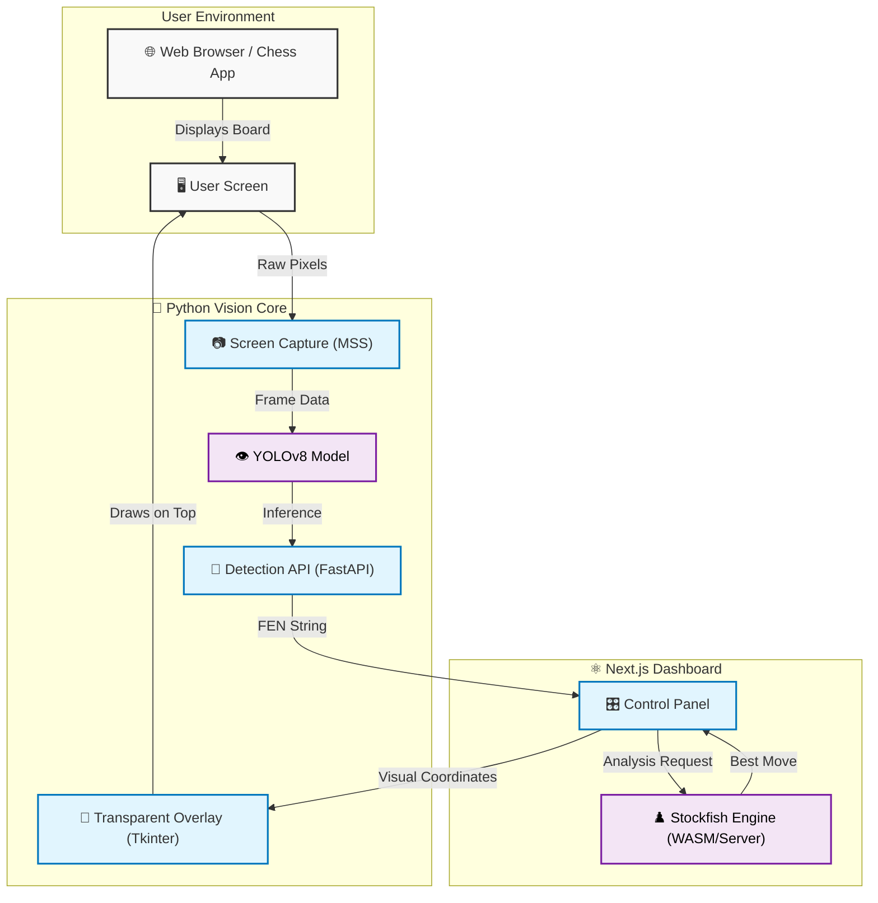
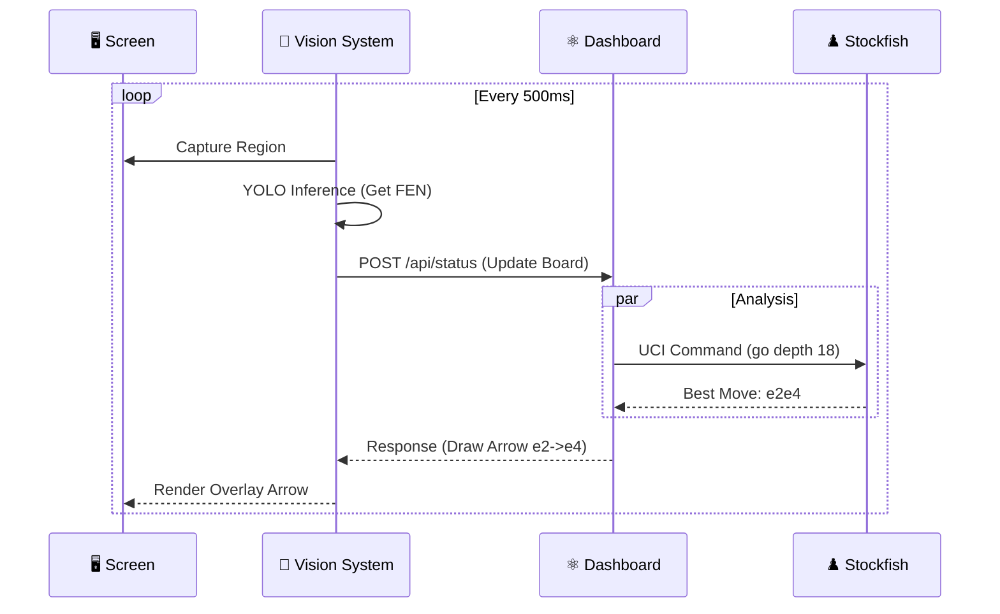

<div align="center">

# MoveOverlay: Chess Vision AI
### Simple, effective, and completely injection-free.
[](https://github.com/editzinter/moveOverlay/blob/main/LICENSE)
[](https://nextjs.org/)
[](https://www.python.org/)
[](https://ultralytics.com/)

---

**MoveOverlay** is a visual-first tool designed for players who want engine analysis without the risks of browser extensions or code injection. It works by "looking" at your screen just like you do, analyzing the board in real-time and drawing tactical advice directly on a transparent overlay.

[Features](#key-features) • [Installation](#setup-guide) • [How it Works](#how-it-works) • [Getting Started](#launching)

</div>

---

> [!CAUTION]
> **Educational Use Only**: I built this project to explore how computer vision (YOLOv8) can interact with real-time screen data. It’s meant for learning and research. Please be responsible and keep in mind the terms of service of the platforms you use.

---

## What makes it different?

Most chess tools try to dig into a website's internal code. **MoveOverlay doesn't.** 

- **Privacy & Safety First**: It analyzes pixels, not browser memory. This means it doesn't touch your browser's internal logic or personal data.
- **Smart Vision**: Uses a fine-tuned YOLOv8 model to "see" pieces and board boundaries exactly as they appear on your screen.
- **Live Guidance**: Once it detects the board, it talks to Stockfish to suggest the best moves and displays them as arrows on a transparent layer.
- **Clean Dashboard**: A simple Next.js interface lets you control everything—adjust engine depth, switch sides, or toggle the overlay on the fly.
- **Zero Configuration**: It automatically figures out if you're playing as White or Black by checking where your pawns are.

---

## How it works

MoveOverlay uses a decoupled architecture to ensure safety and performance. Here is how the magic happens:

### 🏗️ System Architecture



### 🔄 Real-Time Event Loop

Since the two systems run independently, they communicate continuously to keep the overlay in sync with the game.



### The "Secret Sauce"
1.  **The Dashboard (Next.js)** acts as the brain. It holds the state and talks to the engine.
2.  **The Vision System (Python)** acts as the eyes. It just looks at pixels and asks the brain "What should I draw?"
3.  **The Overlay** acts as the hands. It paints the arrows without ever touching the browser itself.

---

## Setup Guide

### What you'll need
Before we start, make sure you have these installed:
- **Node.js** (v24 or newer)
- **Python** (v3.12 or newer)
- **Git**

### Step-by-step Installation

1. **Grab the code**
   ```bash
   git clone https://github.com/editzinter/moveOverlay.git
   cd moveOverlay
   ```

2. **Setup the Dashboard (Frontend)**
   ```bash
   npm install
   ```

3. **Setup the Brain (Backend)**
   ```bash
   pip install -r detector-api/requirements.txt
   ```

### Adding the AI Model
The tool needs the "vision weights" to recognize chess pieces.
1. Download `best.pt` from the **[NAKST Studio Hugging Face page](https://huggingface.co/NAKSTStudio/yolov8m-chess-piece-detection)**.
2. Create a folder called `yolov8m-chess-piece-detection` in the project root.
3. Move your downloaded `best.pt` file into that folder.

---

## Launching

### 1. Start the Dashboard
First, get the control panel running:
```bash
npm run dev
```
Then, open your browser to `http://localhost:3000`.

### 2. Start the Vision System
In a new terminal, run the launcher:
```bash
python detector-api/start.py
```

### 3. Point and Analyze
On the dashboard, hit **"Select Region"**. This will let you draw a box over your chess board. Once you've selected the area, the arrows will start appearing automatically!

---

## Contributing

Created something cool? Found a bug? Feel free to open an issue or send a pull request. I'm always happy to see how people improve this!

## Credits

This project stands on the shoulders of some amazing tools:
- **[NAKST Studio](https://huggingface.co/NAKSTStudio)**: For the fantastic YOLOv8m chess detection model.
- **[Ultralytics](https://ultralytics.com/)**: For making YOLOv8 so accessible.
- **[Stockfish](https://stockfishchess.org/)**: For the world-class engine evaluation.

## License

This project is open-source under the [MIT License](LICENSE).

---

<div align="center">
Built with 💙 by editzinter.
</div>
